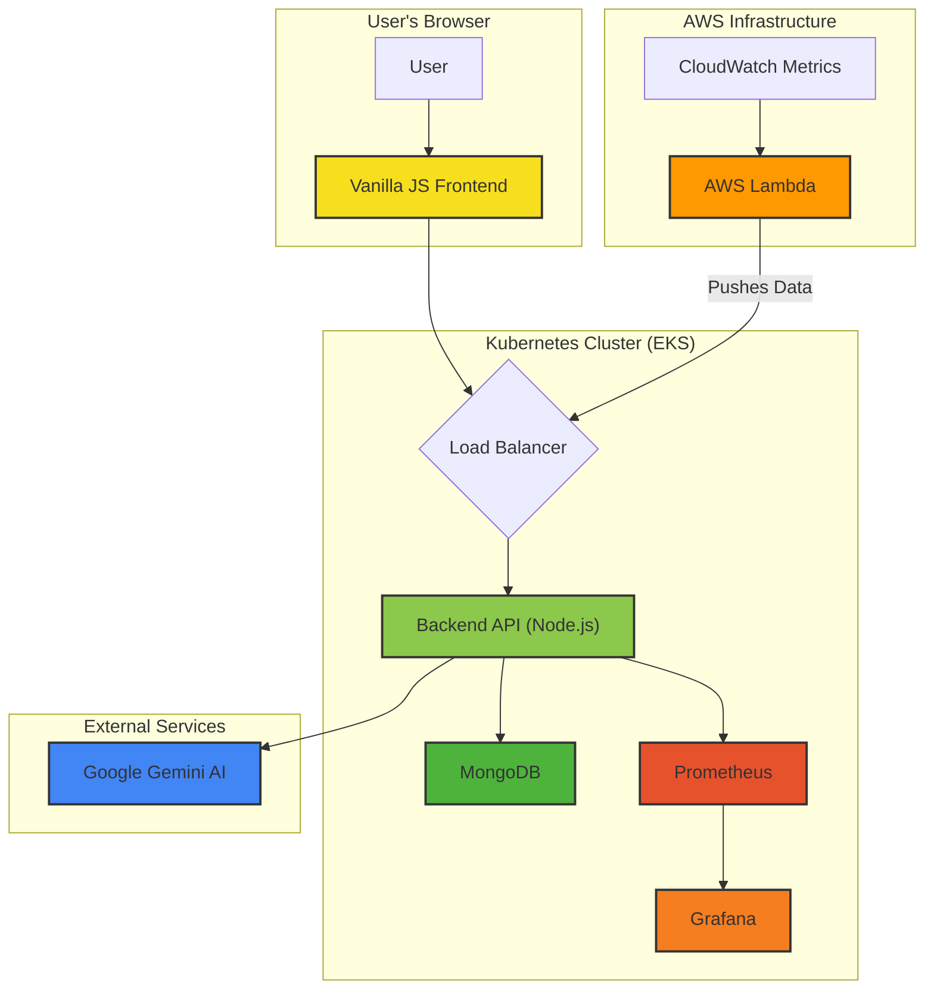
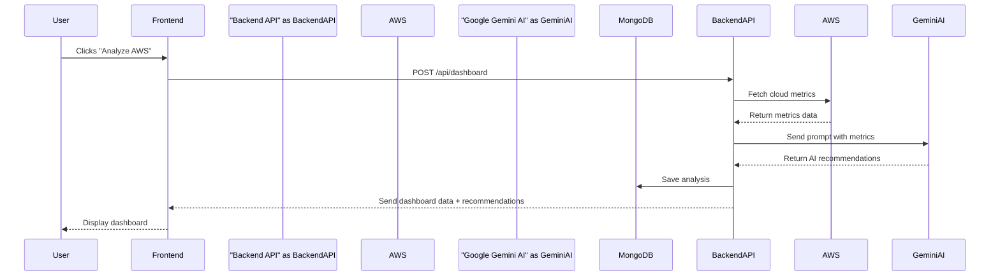

# CostInsight: AI-Powered Cloud Cost Optimization

[](https://choosealicense.com/licenses/mit/)
[](https://travis-ci.com/github/mohdazam193/Cloud-cost)
[](http://makeapullrequest.com)

> A comprehensive, multi-cloud cost optimization and monitoring platform. CostInsight provides real-time insights and AI-driven recommendations to minimize your cloud expenditure.

<br />
<p align="center">
  <a href="https://github.com/mohdazam193/Cloud-cost">
    <!--  -->
  </a>

  <h3 align="center">CostInsight</h3>

  <p align="center">
    Monitor your cloud, get AI advice, and cut costs.
    <br />
    <a href="Layman%20Steps.md"><strong>Explore the docs »</strong></a>
    <br />
    <br />
    <a href="https://github.com/mohdazam193/Cloud-cost/issues">Report Bug</a>
    ·
    <a href="https://github.com/mohdazam193/Cloud-cost/issues">Request Feature</a>
  </p>
</p>

<!-- TABLE OF CONTENTS -->
<details>
  <summary>Table of Contents</summary>
  <ol>
    <li>
      <a href="#about-the-project">About The Project</a>
      <ul>
        <li><a href="#-key-features">Key Features</a></li>
        <li><a href="#-built-with">Built With</a></li>
      </ul>
    </li>
    <li>
      <a href="#-getting-started">Getting Started</a>
      <ul>
        <li><a href="#prerequisites">Prerequisites</a></li>
        <li><a href="#-local-deployment-for-testing">Local Deployment</a></li>
        <li><a href="#-cloud-deployment-amazon-eks">Cloud Deployment</a></li>
      </ul>
    </li>
    <li><a href="#-usage">Usage</a></li>
    <li><a href="#-roadmap">Roadmap</a></li>
    <li><a href="#-contributing">Contributing</a></li>
    <li><a href="#-license">License</a></li>
    <li><a href="#-contact">Contact</a></li>
    <li><a href="#-credits">Credits</a></li>
  </ol>
</details>

---

## About The Project



CostInsight was born from the need for a centralized, intelligent platform to manage the complexities of cloud spending. In a multi-cloud world, it's easy to lose track of resources, leading to budget overruns and inefficient infrastructure.

This platform connects directly to your AWS account to pull real-time metrics, analyzes them using Google's powerful Gemini AI, and presents you with clear, actionable recommendations. Whether you're an individual developer or a large enterprise, CostInsight provides the tools to take control of your cloud costs.

For a simplified, step-by-step guide, please refer to the **[Layman Steps Guide](Layman%20Steps.md)**.

### ✨ Key Features

*   **Real-Time AWS Monitoring:** Live data on EC2, EBS, RDS, Lambda, and more.
*   **🤖 AI-Driven Recommendations:** Utilizes the Gemini AI API for actionable cost-saving advice.
*   **📊 Historical Data Analysis:** Track spending and resource utilization over time.
*   **💬 Interactive Chatbot:** Ask questions about your infrastructure in natural language.
*   **⚙️ Automated Instance Policies:** Set CPU thresholds for alerts or automatic shutdowns.
*   **☁️ Serverless Data Fetching:** AWS Lambda functions keep your data fresh.
*   **🚀 Scalable by Design:** Built on Docker and Kubernetes (EKS) for high availability.
*   **📈 Advanced Monitoring:** Pre-configured support for Prometheus and Grafana.

### Built With

This project is built on a modern, scalable technology stack.

| Tech          | Description                          |
|---------------|--------------------------------------|
| **Backend**   | Node.js, Express.js                  |
| **Frontend**  | HTML, CSS, JavaScript                |
| **Database**  | MongoDB                              |
| **AI**        | Google Gemini                        |
| **Container** | Docker                               |
| **Orchestration**| Kubernetes (Amazon EKS)             |
| **Monitoring**| Prometheus, Grafana                  |
| **Cloud**     | AWS (EC2, EKS, Lambda, S3, IAM)      |

---

## 🏁 Getting Started

Follow these steps to get a local copy up and running.

### Prerequisites

Ensure you have the following tools installed and configured:
*   **npm**
    ```sh
    npm install npm@latest -g
    ```
*   **Docker Desktop**: [Download](https://www.docker.com/products/docker-desktop)
    * Make sure to enable Kubernetes in the settings.
*   **AWS CLI**: [Installation Guide](https://docs.aws.amazon.com/cli/latest/userguide/cli-chap-install.html)
*   **eksctl**: [Installation Guide](https://eksctl.io/introduction/#installation)
*   **MongoDB Atlas Account**: [Create one here](https://www.mongodb.com/cloud/atlas/register)

### 💻 Local Deployment (for Testing)

1.  **Clone the repo**
    ```sh
    git clone https://github.com/mohdazam193/Cloud-cost.git
    cd Cloud-cost
    ```
2.  **Configure Environment**
    *   Create a file named `.env` in the root of the project.
    *   Add the following environment variables to the `.env` file, replacing the placeholder values with your actual credentials:
        ```
        MONGO_URI=your_mongodb_connection_string
        GEMINI_API_KEY=your_gemini_api_key
        ```
3.  **Deploy to local Kubernetes**
    ```sh
    # Create the secret
    kubectl create secret generic costinsight-secrets --from-env-file=.env

    # Apply the manifests
    kubectl apply -f kubernetes/deployment.yaml
    kubectl apply -f kubernetes/service.yaml
    ```
4.  **Access the App**
    *   Open your browser to `http://localhost`.

### ☁️ Cloud Deployment (Amazon EKS)

1.  **Create an EKS Cluster**
    ```sh
    eksctl create cluster --name costinsight-cluster --region us-east-1 --nodes 2
    ```
2.  **Push the Docker Image**
    *   Log in to your preferred Docker registry (e.g., Docker Hub).
    *   Build and push the image to the registry.
    ```sh
    docker build -t your-username/costinsight:latest .
    docker push your-username/costinsight:latest
    ```
    *   **Important:** Update the `image` name in `kubernetes/deployment.yaml` to point to your repository.
3.  **Deploy to EKS**
    ```sh
    kubectl apply -f kubernetes/deployment.yaml
    kubectl apply -f kubernetes/service.yaml
    ```
    *   Find your public URL by running `kubectl get service costinsight-service`. This will be the `EXTERNAL-IP` of the service.
4.  **Deploy Lambda Functions**
    *   Update the `API_ENDPOINT` in `aws-cli/deploy_lambdas.sh` to the public URL of your `costinsight-service`.
    *   Update the `API_KEY` in `aws-cli/deploy_lambdas.sh` to a secure key of your choice.
    *   Run the script:
    ```sh
    bash aws-cli/deploy_lambdas.sh
    ```

---

## Usage

Once deployed, CostInsight provides a user-friendly dashboard to monitor your AWS resources. The interactive chatbot can be used to ask specific questions like:

> "Show me all EC2 instances with CPU utilization below 5% for the last 7 days."

> "What are the top 3 cost-saving recommendations for my account?"

### AI Recommendation Flow

The following diagram illustrates how the application generates cost-saving advice:



---

## 🗺️ Roadmap

-   [ ] Add support for Google Cloud Platform (GCP) and Microsoft Azure.
-   [ ] Implement user roles and permissions.
-   [ ] Create more detailed and customizable dashboards.
-   [ ] Develop an alerting system for budget anomalies.

See the [open issues](https://github.com/mohdazam193/Cloud-cost/issues) for a full list of proposed features (and known issues).

---

## 🤝 Contributing

Contributions are what make the open source community such an amazing place to learn, inspire, and create. Any contributions you make are **greatly appreciated**.

If you have a suggestion that would make this better, please fork the repo and create a pull request. You can also simply open an issue with the tag "enhancement".
Don't forget to give the project a star! Thanks again!

1.  Fork the Project
2.  Create your Feature Branch (`git checkout -b feature/AmazingFeature`)
3.  Commit your Changes (`git commit -m 'Add some AmazingFeature'`)
4.  Push to the Branch (`git push origin feature/AmazingFeature`)
5.  Open a Pull Request

---

## 📄 License

Distributed under the MIT License. See `LICENSE` for more information.

---

## 📧 Contact

Project Admin - mohdazam193

Project Link: [https://github.com/mohdazam193/Cloud-cost](https://github.com/mohdazam193/Cloud-cost)

---

## 🙏 Credits

This project is a fork of [ananyagla/MiniProject_2025](https://github.com/ananyagla/MiniProject_2025). We are grateful for their foundational work.
